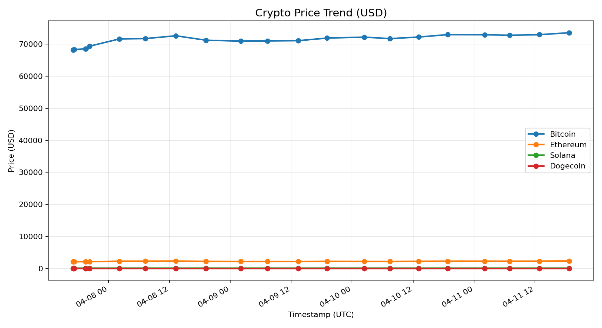
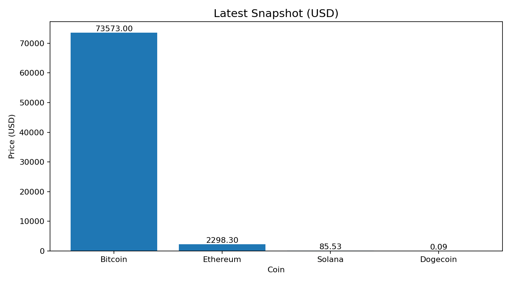

# MarketPulse - Crypto Price Tracker Automation

Production-ready crypto tracker built with Python, Streamlit, and GitHub Actions.

## Live Dashboard

- Last updated (UTC): **2026-04-11T18:41:54+00:00**
- Alert threshold: **+/-5.00%** run-to-run movement
- Tracked coins: Bitcoin, Ethereum, Solana, Dogecoin

### Latest Prices

| Coin | Latest Price (USD) | 24h Change (CoinGecko) | Change Since Last Run |
| --- | ---: | ---: | ---: |
| Bitcoin | $73,573.0000 | +0.82% | +0.82% |
| Ethereum | $2,298.3000 | +2.34% | +2.30% |
| Solana | $85.5300 | +0.68% | +1.50% |
| Dogecoin | $0.0938 | -0.08% | +0.91% |

### Price Trend Chart

### Latest Snapshot Chart

## Architecture

- `src/marketpulse/api_fetcher.py`: CoinGecko client with retry support.
- `src/marketpulse/data_processor.py`: transforms and persists historical JSON + CSV data.
- `src/marketpulse/visualizer.py`: generates matplotlib charts and stores image artifacts.
- `src/marketpulse/notifier.py`: sends threshold alerts to Telegram and/or Email.
- `src/marketpulse/readme_updater.py`: rebuilds this README dashboard section.
- `src/marketpulse/pipeline.py`: orchestrates the full automation pipeline.
- `streamlit_app.py`: lightweight web dashboard for local or hosted viewing.
- `.github/workflows/marketpulse.yml`: CI/CD automation every 6 hours.

## Data Outputs

- `data/historical_prices.json`
- `data/historical_prices.csv`
- `charts/price_trends.png`
- `charts/latest_snapshot.png`

## Local Run

1. Create virtual environment and install dependencies:
   - `python -m venv .venv`
   - `pip install -r requirements.txt`
2. Configure `.env` from `.env.example`.
3. Execute pipeline:
   - `python scripts/run_pipeline.py`
4. Run Streamlit app:
   - `streamlit run streamlit_app.py`

## GitHub Actions Automation

The workflow in `.github/workflows/marketpulse.yml`:

- runs on `cron: 0 */6 * * *`
- fetches latest prices
- updates JSON, CSV, charts, and README
- commits and pushes changes back to the repository

## Docker

Build and run the automation container:

- `docker build -t marketpulse .`
- `docker run --rm --env-file .env marketpulse`

This project is designed for easy extension into a full-stack dashboard with APIs, databases, and realtime front-end clients.
